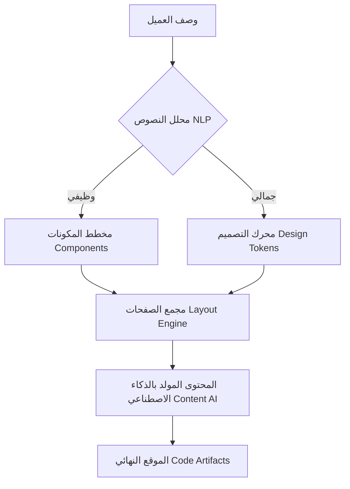

# مخطط تدفق الأوركسترا الذكية (AI Orchestration Flow)

## حالة دراسية: "مطعم مأكولات بحرية عائلي"
**الطلب:** "أريد موقعًا لمطعم عائلي يقدم وجبات بحرية، مع قائمة طعام قابلة للتنزيل، ونموذج لحجز الطاولات، وصورة للطهاة، وألوان تذكرني بالبحر."

### 1. مرحلة التحليل والاستخلاص (Entity Extraction)
- **المتطلبات الوظيفية:**
  - `Menu_Download_Component` (قائمة طعام).
  - `Booking_Form_Logic` (نموذج حجز).
  - `Gallery_Section` (صور الطهاة).
- **المتطلبات الجمالية (Style Engine):**
  - `Base_Color`: Ocean Blue / Teal.
  - `Typography`: Warm Sans-Serif (للمسة العائلية).
  - `Tone`: Friendly & Welcoming.

### 2. التخطيط المعماري (Structural Mapping)
سيحدد المعالج أن الموقع يحتاج إلى:
- **الصفحة الرئيسية:** (Hero + Fast Booking).
- **صفحة المنيو:** (Menu Display + Download Button).
- **صفحة الفريق:** (Chef Bios & Photos).
- **صفحة التواصل:** (Map + Reservation Form).

### 3. مرحلة توليد المحتوى (Generative Stage)
- **العنوان الرئيسي:** "طعم البحر الأصيل في أجواء عائلية دافئة".
- **النص الوصفي:** "نقدم لكم طقوس البحر اليومية، محضرة بأيدي طهاتنا المبدعين لتناسب جميع أفراد عائلتكم".
- **البيانات الوهمية:** إنشاء قائمة أسعار منطقية (سمك مشوي، روبيان، إلخ) لملء المكان.

### 4. مرحلة التكامل البرمجي (Assembly & Deployment)
- سحب المكونات من `src/components/templates/`.
- حقن المتغيرات (JSON Variables) في المكونات.
- توليد ملفات `index.html`, `styles.css` النهائية.

